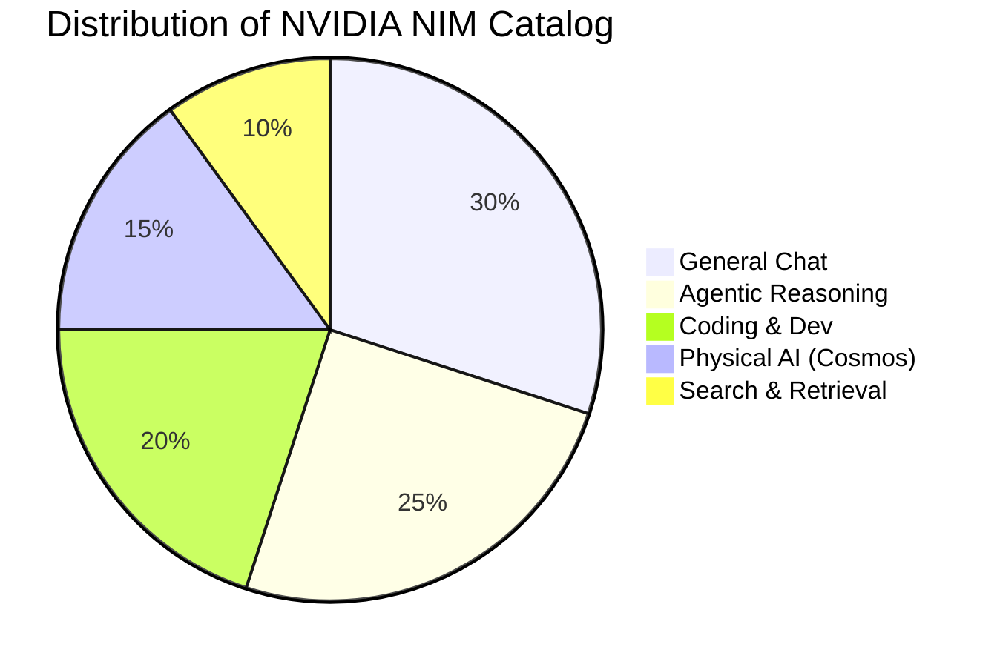

#  NVIDIA Model Intelligence Report: 2026 Catalogue

A comprehensive analysis and comparison of NVIDIA-optimized models available in the ModelForge v3.02 workspace.

---

## 🚀 Executive Summary
NVIDIA NIM (Inference Microservices) provides the backbone for the high-performance catalog. By leveraging **TensorRT-LLM** and **Blackwell-optimized** kernels, these models offer up to **3.3x higher throughput** than standard open-weights deployments. The 2026 fleet is defined by **Mixture-of-Experts (MoE)** and **Hybrid Mamba-Transformer** architectures, enabling billion-parameter reasoning at sub-second latencies.

---

## 📊 Comprehensive Comparison Matrix

### Core Generative & Reasoning Models
| Model Name | Parameter Count | Context Window | Primary Strength | Reasoning Score |
| :--- | :--- | :--- | :--- | :--- |
| **Llama 4 Maverick** | 400B (17B Active) | 1M Tokens | High-Intelligence Flagship | ⭐⭐⭐⭐⭐ |
| **DeepSeek V3.1 Terminus**| 671B (MoE) | 128K Tokens | Agentic CLI / Terminal | ⭐⭐⭐⭐⭐ |
| **Nemotron Super 49B**| 49B (Dense) | 128K Tokens | Human-Chat Alignment | ⭐⭐⭐⭐ |
| **Nemotron-3 Nano 30B** | 30B (3.2B Active)| 1M Tokens | Fast Agentic Loops | ⭐⭐⭐⭐ |
| **Cosmos Reason2 8B** | 8B (VLA) | 256K Tokens | Physical AI & Robotics | ⭐⭐⭐⭐⭐ (Physics) |

### specialized Domain Models
| Category | Model Name | Optimized Task | Key Metric |
| :--- | :--- | :--- | :--- |
| **Coding** | **Qwen 3 Coder 480B** | Elite Software Engineering | 100+ Languages |
| **Vision** | **Nemotron Nano 12B VL**| Multimodal Doc Parsing | 131K Context |
| **Context** | **Minimax-M2.1** | "Infinite" Document Analysis| 4M Context Window |
| **Search** | **NV EmbedQA E5 v5** | Semantic Vector Retrieval | 8K Dense Retrieval |
| **Audio** | **Parakeet CTC 0.6B** | Real-time Transcription | Sub-50ms Latency |

---

## 🏆 Deep Dive: The Heavy Hitters

### 1. Llama 4 Maverick 17B (MoE)
> **The Multimodal Standard**
*   **Strengths:** Nuanced abstract reasoning and high-fidelity multimodal understanding. 
*   **Best For:** Complex research, creative writing, and cross-modality reasoning.
*   **Weakness:** High resource overhead; significantly more compute-intensive than *Scout*.

### 2. Nemotron-3 Nano 30B
> **The Efficiency King**
*   **Strengths:** Uses a Hybrid Mamba architecture for linear scaling and incredible throughput.
*   **Best For:** Multi-agent swarms where token-per-second (TPS) is critical.
*   **Weakness:** Can be verbose; requires a "thinking budget" configuration for cost control.

### 3. DeepSeek V3.1 Terminus
> **The Developer's Choice**
*   **Strengths:** Fine-tuned for terminal stability and precise tool use. Zero-shot CLI proficiency.
*   **Best For:** Automated dev-ops, script generation, and terminal-agent workflows.
*   **Weakness:** Context window limited to 128K (compared to Gemini/Minimax).

### 4. Cosmos Reason2 8B
> **Physical World Intelligence**
*   **Strengths:** Native spatio-temporal logic. Understands 3D bounding boxes and video causality.
*   **Best For:** Robotics, video analytics, and simulation reasoning.
*   **Weakness:** Low coding proficiency; specialized strictly for vision-language-action (VLA).

---

## 📐 Pivot Analysis: Capabilities vs. Performance

---

## 💡 Recommendations for 2026 Workflows

| If you need... | Use this Model | Why? |
| :--- | :--- | :--- |
| **Zero-Latency Chat** | **Llama 4 Scout** | Sub-second first-token response. |
| **Massive Code Refactor** | **Minimax-M2.1** | 4M context window fits the whole repo. |
| **Precise Log Analysis** | **Qwen 2.5 Coder** | SOTA open-weights coding logic. |
| **Video Scene Search** | **Cosmos Reason2** | Native video-native reasoning. |
| **Scale RAG Systems** | **NV EmbedQA** | Industry standard for dense retrieval. |

---
*Created for ModelForge v3.02 Workspace Analysis - February 2026*
